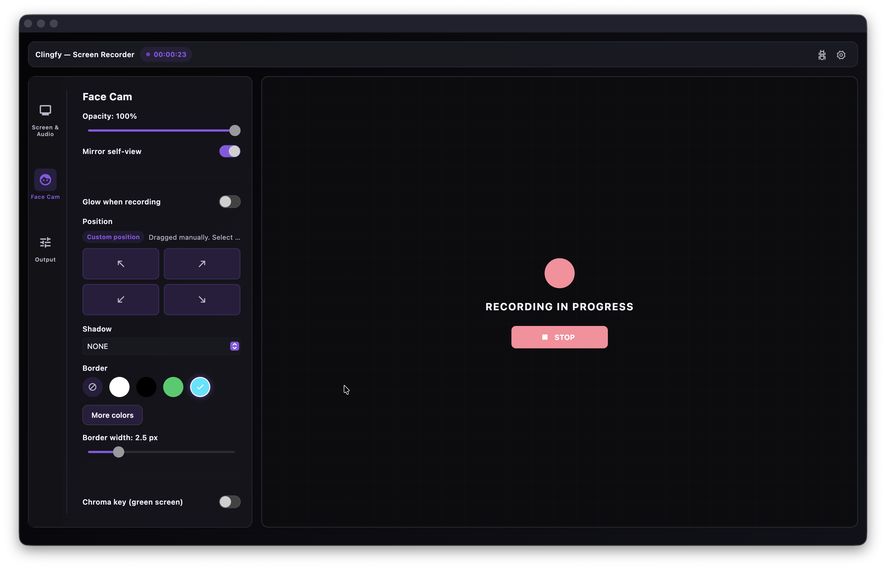
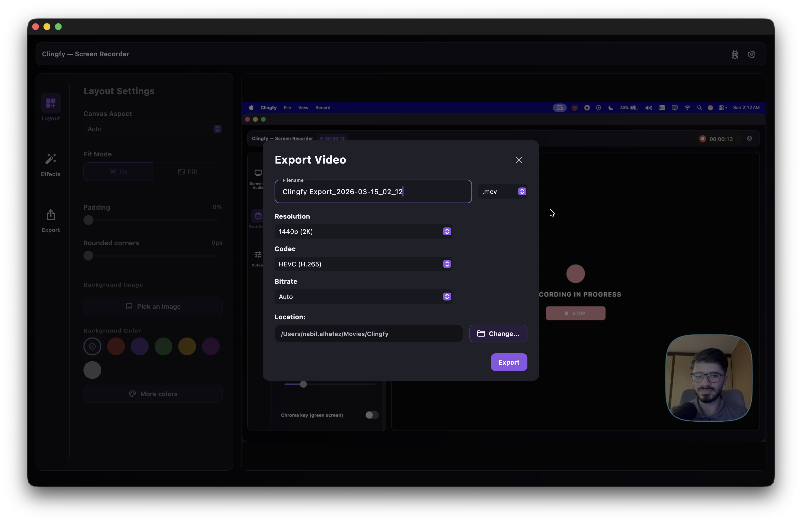

<p align="center">
  
</p>

<h1 align="center">Clingfy</h1>

<p align="center">
Modern macOS screen recorder built with Flutter and a native capture engine.
</p>

<p align="center">
Record displays, windows, or custom areas with camera overlay, cursor tracking, zoom effects, and powerful export options.
</p>

<p align="center">
⭐ If you find Clingfy useful, consider starring the repository.
</p>


[](https://dev.azure.com/clingfy/Clingfy/_build/latest?definitionId=1&branchName=main)
[](LICENSE)


---


---

Clingfy is a modern **macOS screen recorder** designed for **developers, educators, and content creators**.

It combines a **Flutter desktop interface** with a **native macOS capture engine** to deliver high-performance recording, preview, overlays, and export workflows.

Record your display, a single window, or a custom area. Add a camera bubble, highlight the cursor, follow the action with zoom effects, and export in the format that fits your workflow.

**Official builds:**  
https://clingfy.com

---

# Why Clingfy?

Clingfy is designed for developers and creators who want **fast, high-quality screen recordings without complex editing workflows**.

Key goals:

- fast recording workflow
- native macOS performance
- modern desktop UI
- flexible export options
- high-quality tutorial and demo creation

---

# Features

- Record the **full display**
- Record a **single app window**
- Record a **custom area**
- Add a **camera overlay**
- Highlight and track the **cursor**
- Use **zoom-follow effects**
- Preview recordings before exporting
- Export with aspect ratio presets such as **16:9**, **9:16**, and more
- Export as **MP4**, **MOV**, or **GIF**
- Use high-resolution export presets
- Receive updates through native **macOS updater integration**

---

# Screenshots

| Recording UI                                              | Export Flow                                           |
| --------------------------------------------------------- | ----------------------------------------------------- |
|  |  |

# Architecture

Clingfy combines a **Flutter desktop UI** with a **native macOS capture engine**.

Main layers:

- Flutter desktop interface
- domain engine in Dart
- native macOS capture pipeline
- preview and export engine
- platform bridges for permissions and overlays

This hybrid architecture allows **high-performance screen capture** while maintaining a **modern cross-platform UI framework**.

More details:  
`docs/architecture.md`

---

# Installation

Download the latest official build from:

https://clingfy.com/download

Or build locally:

```bash
flutter build macos --flavor prod
```

---

# Current Scope

- Production target today: **macOS desktop**
- UI shell: **Flutter**
- Capture, preview, export, and platform engine: native macOS (`macos/Runner`)
- Windows support may come later, but the current public product is **macOS-first**

---

# Repository Layout

- `lib/core` — recorder engine logic, reusable domain models, bridges, permissions, preview, export, post-processing, zoom, and overlay domain code
- `lib/app` — desktop app shell, navigation, onboarding, settings, workflow, and non-commercial UI state
- `lib/commercial` — client-side licensing, paywall, entitlement UI, and related commercial client logic
- `lib/ui` — shared platform widgets, design tokens, and theme
- `macos/Runner` — native macOS capture, preview, overlays, permissions, updater integration, and platform glue
- `ops/release` — public operational tooling and release automation scripts that depend on private credentials not stored in the repository

---

# Roadmap

Planned improvements:

- Windows support
- advanced editing tools
- AI-assisted recording workflows
- collaborative recording tools

---

# Licensing

Clingfy is licensed under **GPL-3.0-or-later**.

Commercial licensing is also available for:

- proprietary redistribution
- embedding Clingfy technology in closed-source software
- custom commercial agreements

The public repository does **not** include:

- backend services
- payment infrastructure
- signing credentials
- release artifacts
- cloud or AI systems

See:

- [LICENSE](LICENSE)
- [LICENSING.md](LICENSING.md)

---

# Development

### Prerequisites

- Flutter stable
- Xcode and CocoaPods for macOS development
- local private configuration provided out-of-band when required for maintainer-only release flows

### Common Commands

```bash
flutter pub get
flutter analyze
flutter test
flutter build macos --flavor dev
flutter build macos --flavor prod
```

For more detail:

`docs/development.md`

---

# Open vs Private Surface

### Public in this repository

- app and client code
- native macOS client implementation
- client-side licensing UI and logic
- public operational tooling without embedded secrets

### Private and intentionally excluded

- signing keys and provisioning assets
- backend or payment-provider server logic
- cloud or AI infrastructure
- release archives, DMGs, appcasts, and internal logs
- local environment files and other secret material

---

# Official Builds and Contact

Official builds and product information:
[https://clingfy.com](https://clingfy.com)

Commercial licensing:
[contact@clingfy.com](mailto:contact@clingfy.com)

Security reports:
[contact@clingfy.com](mailto:contact@clingfy.com)

---

# Contributing and Security

Contribution guide:
[CONTRIBUTING.md](CONTRIBUTING.md)

Security reporting:
[SECURITY.md](SECURITY.md)

Publish checklist:
[docs/release-readiness.md](docs/release-readiness.md)
